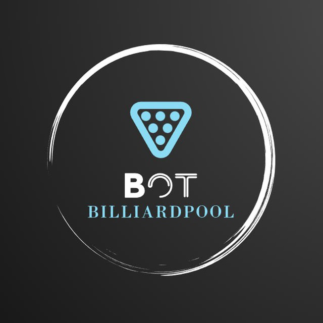
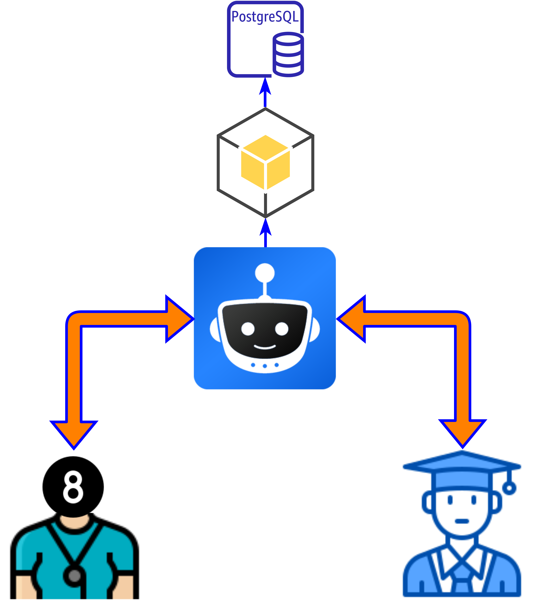

## Billiard_helper / Telegram_bot


[@PoolBilliard_bot](https://t.me/PoolBilliard_bot)



Асинхронный бот для облегчения взаимоотношения между тренером и учеником

Написан с использованием:
* aiogram 3.x
* telegram bot api
* asyncio
* SQLAlchemy
* asyncpg
* psycopg2
* pydantic
* alembic
* aiohttp




### Для работы необходимо указать следующие переменные окружения

    BOT_TOKEN = example_token
    
    # for database    
    DB_PARAMS = {'user': 'EXAMPLE', 'password': 'EXAMPLE', 'host': '127.0.0.1', 'database': 'tgBot'}

## Старт

Запуск бота:
```shell
python bot.py
